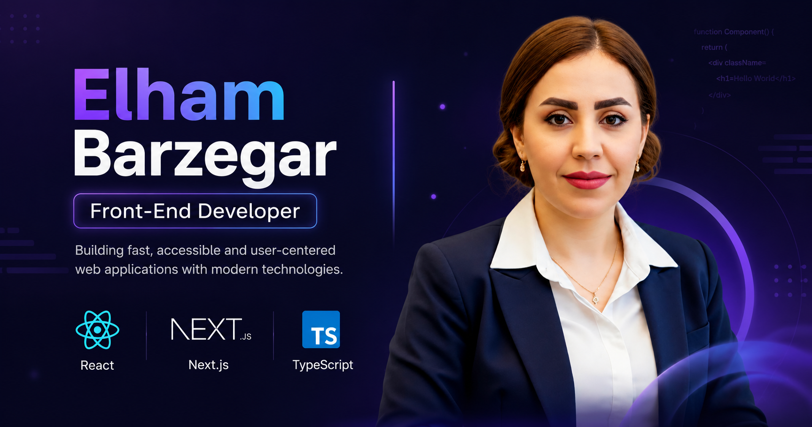

&nbsp; 
# Hi, I'm Elham Barzegar 👋

## Front-End Developer | React • Next.js • TypeScript

I am a Front-End Developer with 8+ years of experience building scalable, high-performance, and user-focused web applications.

I specialize in React, Next.js, TypeScript, and modern front-end architecture, creating clean, maintainable, and accessible interfaces with a strong focus on performance and user experience.

I enjoy transforming complex ideas into intuitive digital products and continuously improving my skills through modern technologies, software engineering practices, and AI-powered development tools.

---

## 🌐 Portfolio

🚀 Personal Website:

🔗 https://elhambarzegar.ir

---

## 🤝 Let's Connect

I'm interested in collaborating on innovative web applications and connecting with developers, engineers, and technology teams.

🟦 LinkedIn  
https://www.linkedin.com/in/elham-barzeghar/

📧 Email  
elhambarzegar.hs@gmail.com

---

## 🛠 Tech Stack

### Front-End Development

### UI & Styling

### Tools & Workflow

---

## 🚀 Featured Project

### Personal Portfolio Website

A modern developer portfolio built with:

- Next.js
- TypeScript
- Tailwind CSS
- Responsive Design
- SEO Optimization
- Schema.org Structured Data
- Open Graph Integration
- Google Analytics
- Microsoft Clarity

🌐 Live Demo:

🔗 https://elhambarzegar.ir

---

## 🚀 Areas of Interest

- Advanced React and Next.js patterns
- Front-End performance optimization
- Scalable software architecture
- Accessibility and user experience
- AI-assisted development workflows
- Building modern web applications

---

## 💡 What I Focus On

✨ Writing clean and maintainable code  
✨ Building reusable components  
✨ Improving application performance  
✨ Creating accessible user interfaces  
✨ Turning designs into real products  

---

## ⭐ Let's Build Something Great Together

I am always open to interesting projects, collaboration opportunities, and connecting with passionate technology teams.

&nbsp; 

